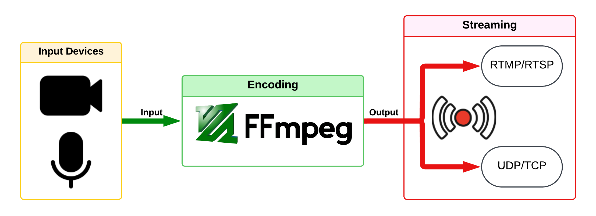

# Live Encoder-Streamer

This is a Python-based tool for live streaming video and audio using **FFmpeg**. This script supports streaming to **UDP/TCP** and/or **RTMP/RTSP** endpoints with customizable configurations for video and audio devices. It is compatible with both **Windows** and **Linux** platforms.

------------------------------------------------------------------------------------



## Features

- **Multi-Platform Support**:
  - Uses `dshow` for Windows and `v4l2/alsa` for Linux to handle video and audio devices.
- **Multiple Streaming Outputs**:
  - Stream simultaneously to **UDP/TCP** and **RTMP/RTSP** or choose one based on your preference.
- **Customizable Streaming Options**:
  - Adjust video resolution, frame rate, audio bitrate, and more.
- **Device Listing**:
  - Easily list available video and audio devices.
- **Error Monitoring**:
  - Captures and displays FFmpeg errors in real-time.

## Prerequisites
**FFmpeg**: Make sure FFmpeg is installed and added to your system's PATH or provide its installation path in the script

Linux:   
```bash
sudo apt install ffmpeg
```

Windows:   
[https://www.ffmpeg.org/download.html](https://www.ffmpeg.org/download.html#build-windows)

## Usage

### Step 1: Clone this repository

```bash
git clone https://github.com/reab5555/ffmpeg-streaming-tool.git
cd ffmpeg-streaming-tool
```

### Step 2: Install the required dependencies
```bash
pip install -r requirements.txt
```

### Step 3: Configure the script
Edit the config section in the script to provide:   

- Path to FFmpeg binary (if on Windows).   
- UDP and RTMP URLs for streaming.   

### Step 4: Run the script
```bash
python streamer.py
```

### Step 5: Follow on-screen prompts
1. List available devices.   
2. Choose video and audio devices.   
3. Select the desired streaming option (UDP, RTMP, or both).   

### Video Settings

1. **`-preset veryfast`**
   - Determines the speed vs. compression trade-off.
   - Faster presets (`veryfast`, `ultrafast`) use less CPU but produce larger files. Slower presets (`medium`, `slow`) produce smaller files but use more CPU.

2. **`-s 1920x1080`**
   - Sets the resolution of the output video.
   - Example: `1920x1080` (Full HD), `1280x720` (HD), `640x360` (low quality).

3. **`-r 25`**
   - Sets the video frame rate (frames per second).
   - Common values: `24`, `25`, `30` for standard playback, `60` for smoother or high-action content.

4. **`-b:v 2500k`**
   - Sets the video bitrate, determining video quality and bandwidth usage.
   - Example: `1000k` for low quality, `2500k` for HD, `5000k` for high-quality Full HD.

---

### Audio Settings

5. **`-c:a aac`**
   - Specifies the audio codec. `aac` is widely compatible with good compression and quality.

6. **`-b:a 128k`**
   - Sets the audio bitrate, affecting audio quality and bandwidth.
   - Example: `64k` for low quality, `128k` for standard quality, `192k` for high quality.

7. **`-ar 44100`**
   - Sets the audio sample rate. `44100 Hz` is standard and widely supported.

---

### RTMP Output

8. **`-f flv`**
   - Specifies the output format. `flv` is required for RTMP streaming.
